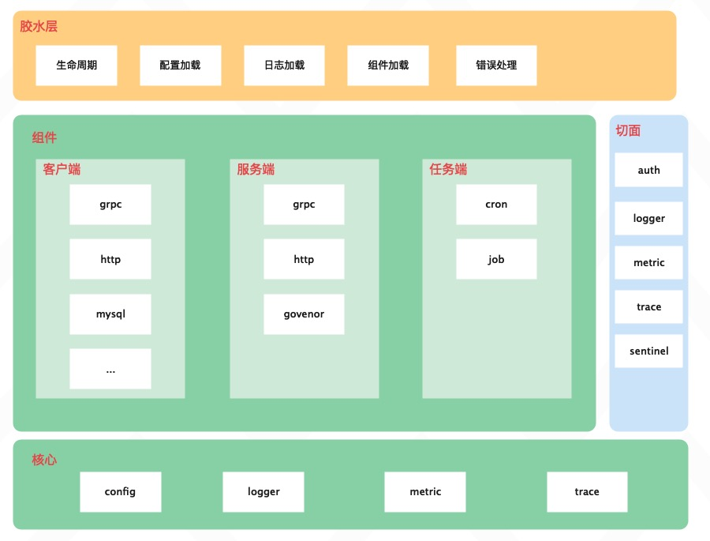

# EGO简介

## 介绍
EGO是一个集成里各种工程实践的框架。通过组件化的设计模式，保证了业务方能够统一的调用方式启动各种组件

使用EGO的优势
- 配置化驱动组件
- 屏蔽底层组件启动细节
- 微服务组件的可观测、可治理
- 可插拔的Ego-Component组件
- Fail Fast理念和错误友好提示

## 框架背景
2016年9月斗鱼开始从Go转变，经历了斗鱼的高并发、大量业务的4年实践，在2020年开源了Jupiter框架。EGO框架基于Jupiter的理念，做了代码精简和优化，并进行了重新设计。

## EGO的理念
一个好的框架，应该更加遵从工程效率，解放工程师的双手，减少重复劳动力。

工程效率主要体现在以下三点：
- 提升组件熟练度
- 提升故障排查效率
- 自动生成重复代码

### 提升组件熟练度
我们工程师要想提升组件熟练度，首先要大量看开源组件文档和代码，然后坚持长时间使用，才能形成肌肉记忆，提升我们做业务的速度。而这一切所投入的时间和精力是非常大的。

要减少这个投入成本，让更多开发者使用好优秀的开源组件，EGO的做法是标准化所有开源组件，对其做一层封装，统一各种行为。
* 统一组件文件名
* 统一组件配置参数
* 统一组件调用API
* 统一组件错误行为
* 统一组件监控行为
让人掌握了一种组件，就可以举一反三使用其他组件。

### 提升故障排查效率
* 统一错误码
* 组件错误、慢响应、链路、常规请求拦截器埋点（服务端、客户端均会拦截）
* 收敛错误字段
* 注入组件关键信息、包名、配置名、地址等
* 调试阶段，错误高亮、格式化友好提示
* 调试阶段，组件内置debug拦截器

### 自动生成重复代码
* 生成代码，配置、数据解析、模版分离
* 不依赖于语言，构建项目代码

## EGO的定义
### 框架分层
我们框架分为三个层次
* 核心层提供配置、日志、监控和链路，是其他组件的基石。
* 组件层提供客户端、服务端、任务端里的各种组件
* 胶水层控制了各种组件的生命周期，错误处理

### 组件分层
我们认为一切均是组件，我们将组件分为四个部分
- Container 处理组件类型、组件配置、组件启动
- Config    配置参数
- Component 组件的调用方法
- Options   配置和组件可选项

<Vssue title="readme" />
